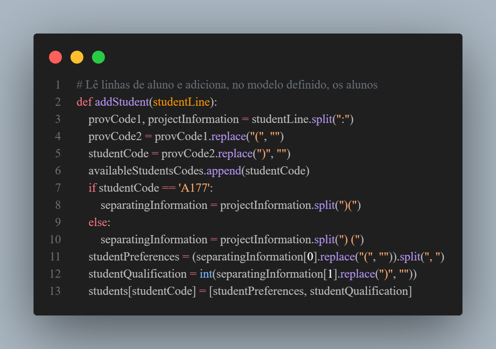

# Gale Shapley Algorithm for Student Allocation

Este projeto é uma implementação do Gale Shapley algorithm cujo propósito é buscar um emparelhamento máximo e estável dado um grafo bipartido.

Para formar o grafo bipartido, foi usado uma base de dados em formato txt que possui alunos e projetos. Ambos possuem algumas informações importantes para o máximo de alunos serem alocados em suas preferências de projeto.

A implementação, portanto, inicia consumindo o arquivo txt e fomentando as seguintes estruturas definidas que serão utilizada para resolver o problema em questão.

Os alunos possuem seus códigos, suas preferências de projetos e suas nota. Por isso, foi utilizado um dicionário que contém como chave dos alunos seus código e suas outras informações relavantes como valor correspondente. Para três alunos, tal estrutura pode ser observada abaixo:

```python
availableStudents = {
    'A1': [['P1', 'P30', 'P50'], 5],
    'A2': [['P1', 'P30', 'P51'], 5],
    'A3': [['P30', 'P34', 'P35'], 3]
}
```

Os projeto terão uma estrutura similar, possuem seus códigos, o número de vagas disponíveis e o requisito mínimo de nota. Além disso, para termos um controle dos alunos presentes naquele projeto, adicionamos um dicionário que tem os alunos alocados ao projeto. Para dois projetos, tal estrutura pode ser observada abaixo:

```python
projects = {
    'P1': [3, 5, {'A1': [['P1', 'P30', 'P50'], 5], 'A2': [['P1', 'P30', 'P51'], 5]}],
    'P2': [1, 5, {'A32': [['P2', 'P20', 'P4'], 5]}],
}
```

Para ler o arquivo e adequar os dados às estruturas pensadas foram usadas as seguintes funções:

1. A função abaixo "addProject", lê a linha dos projetos e remove caractéres irrelevantes e converte alguns dados para seus devidos tipos.


2. A função "addStudent", lê a linha dos alunos e remove caractéres irrelevantes e converte alguns dados para seus devidos tipos.



3. Por fim, a função "processFile", abre o arquivo "dataEntry.txt" e realiza a leitura e chamada das funções anteriores para compor os dicionários definidos com as informações necessárias.


A partir de agora iremos implementar propriamente o algoritmo Gale-Shapley.

1. Inicialmente teremos um loop para iterar sobre os alunos para que possamos alocá-los nos projetos (Podemos limitar a quantidade de iterações utilizando a variável "contador"). Para identificarmos cada aluno temos a variável "currentStudentCode" e, além disso, as informações desse aluno serão armazenadas em "currentStudentData". Ademais, tornamos esse aluno indisponível para futuras alocações e criamos uma variável de controle para identficar se o aluno que estamos tentando alocar foi alocado ou não.


2. Nesse momento iniciaremos a alocação do indivíduo, de forma que consideraremos a nota e as preferências por projeto do aluno. É necessário armazenar as especificações do projeto, de maneira que possamos verifcar se um aluno é qualificado ou não para ser alocado em determinado projeto.


3. Caso o aluno tenha a nota necessária para ser aprovado e a quantidade de vagas do projeto não estiver totalmente preenchida, alocamos com êxito esse indivíduo. Portanto, podemos adicionar esse aluno no dicionário que identifica os alunos alocados em cada projeto e mudamos o status de "currentStudentAllocated" para "true".


4. Porém, caso o aluno esteja qualificado para entrar no projeto mas todas as vagas foram preenchidas, teremos que compará-lo com os outros indivíduos previamente alocados para checarmos a prioridade em relação à alocação naquele projeto. Caso o estudante que estamos tentando alocar possuir uma preferência maior pelo projeto do que o outro aluno, o adicionamos no projeto e retiramos o aluno antigo, de forma que ele voltará para a condição de aluno não alocado para que futuramente possamos realocá-lo.


5. Entretanto, é preciso se atentar ao caso de que ambos os alunos tenham a mesma preferência por um projeto. Nesse caso, teremos que analisar a nota de ambos os candidatos para decidir a alocação. A lógica implementada prevê que o aluno com a maior nota entre ambos será retirado, pois posteriormente ele terá mais chances de ser alocado em outros projetos. Assim, o aluno com menor nota fará parte do projeto enquanto o outro será colocado em "avaliableStudentsCodes" para que sua alocação seja possível futuramente.


6. Por fim, caso não seja possível alocar o estudante em nenhum dos projetos de sua preferência, iremos colocar esse aluno em "notAlocatedStudents".


Após finalizarmos a seleção dos alunos, podemos exibir o resultado final da alocação.

1. A função abaixo foi criada para organizar melhor o dicionário com os alunos alocados


2. O trecho de código abaixo é utilizado para mostrar os alunos alocados em cada um dos projetos existentes


3. Abaixo temos o resultado obtido. Dos 200 alunos disponíveis, cerca de 30% foram alocados

```python
Em 214 iteracoes foram alocados 56 alunos dos 200 disponiveis.
{'P1': ['A1', 'A2', 'A200'], 'P2': ['A32'], 'P3': ['A4', 'A33'], 'P4': ['A5'], 'P5': ['A85', 'A185'], 'P6': ['A8'], 'P7': ['A117', 'A187'], 'P8': ['A18', 'A188'], 'P9': ['A23', 'A26'], 'P10': ['A24'], 'P11': [], 'P12': ['A31'], 'P13': [], 'P14': ['A41', 'A43'], 'P15': ['A44', 'A135'], 'P16': ['A42'], 'P17': ['A61'], 'P18': ['A101'], 'P19': [], 'P20': ['A52'], 'P21': ['A145'], 'P22': ['A144'], 'P23': ['A197'], 'P24': ['A91'], 'P25': ['A104'], 'P26': ['A48', 'A93'], 'P27': ['A81', 'A83'], 'P28': ['A127'], 'P29': ['A63'], 'P30': ['A3'], 'P31': [], 'P32': [], 'P33': [], 'P34': ['A174'], 'P35': ['A55'], 'P36': ['A56', 'A68'], 'P37': ['A137'], 'P38': ['A107'], 'P39': [], 'P40': ['A6'], 'P41': ['A7', 'A27'], 'P42': [], 'P43': ['A46'], 'P44': ['A82'], 'P45': ['A155'], 'P46': [], 'P47': ['A58'], 'P48': ['A35'], 'P49': ['A159'], 'P50': [], 'P51': ['A96'], 'P52': [], 'P53': ['A60', 'A95'], 'P54': [], 'P55': []}

```
